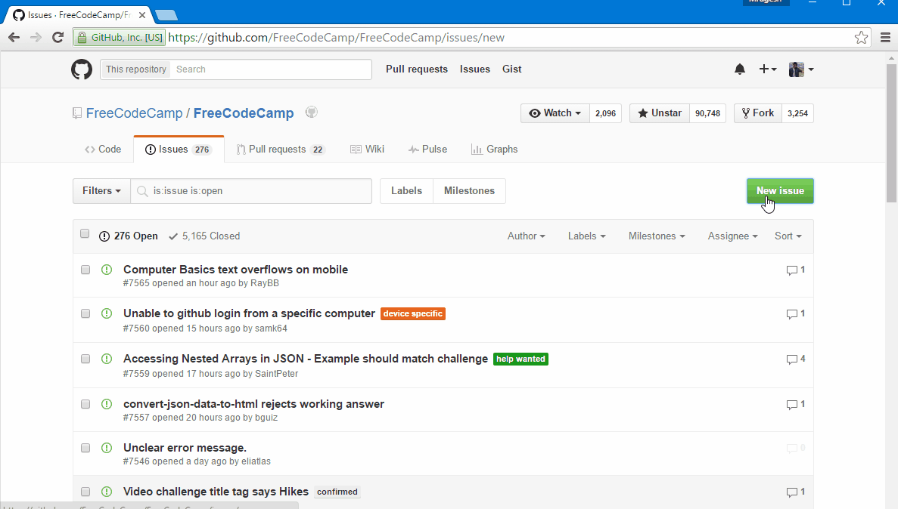
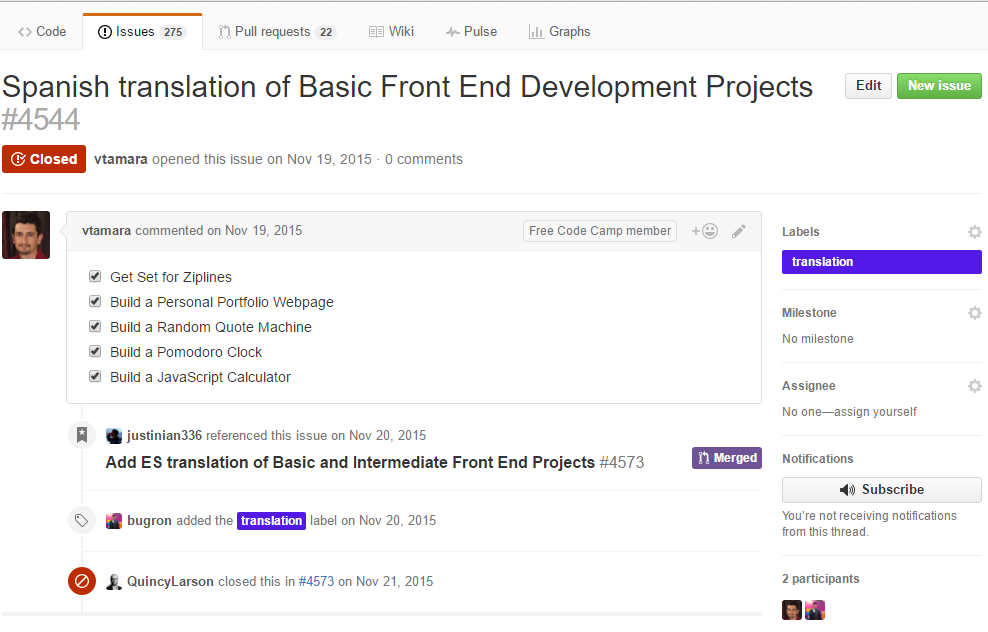

# Create Translation issues to track the progress.

Before starting translations of challenges, GitHub issues need to be created specific to the language of translation. Translators should create issues with the details of the challenges to be tracked in that particular issue.

##  

**FreeCodeCamp's [Issues Section](https://github.com/FreeCodeCamp/FreeCodeCamp/issues), has mainly two kinds of requests related with the translation of the challenges:**

- Some to start the translation of one of the files in the directory `seeds/challenges`. See for example: [Issue #4544](https://github.com/FreeCodeCamp/FreeCodeCamp/issues/4544)

- Other issues requesting to verify or to update an existing translation of one the files in directory `seeds/challenges`. For example: [Issue #6517](https://github.com/FreeCodeCamp/FreeCodeCamp/issues/6517). These can be reopened when there is a change in the English version of the challenge.

> _Pro Tip : You can quickly check issues related to translation by looking for the [`translation`](https://github.com/FreeCodeCamp/FreeCodeCamp/issues?q=is%3Aissue+is%3Aopen+label%3Atranslation)_ label.

If you see issues already open for the challenges, then you could proceed to working on them.

If you can't see any related issues, or that can't be reopened, then start by __creating__ them for the challenge category you would like to work on. Remember to discuss in the Chat room for a confirmation of the challenges that you would like to add to the issue.

> _Pro Tip : Follow the example shown above, for consistency in the formatting of the issues, like adding checklists for challenges._

[**Back to Translations Guide**](Translation-Guide)
